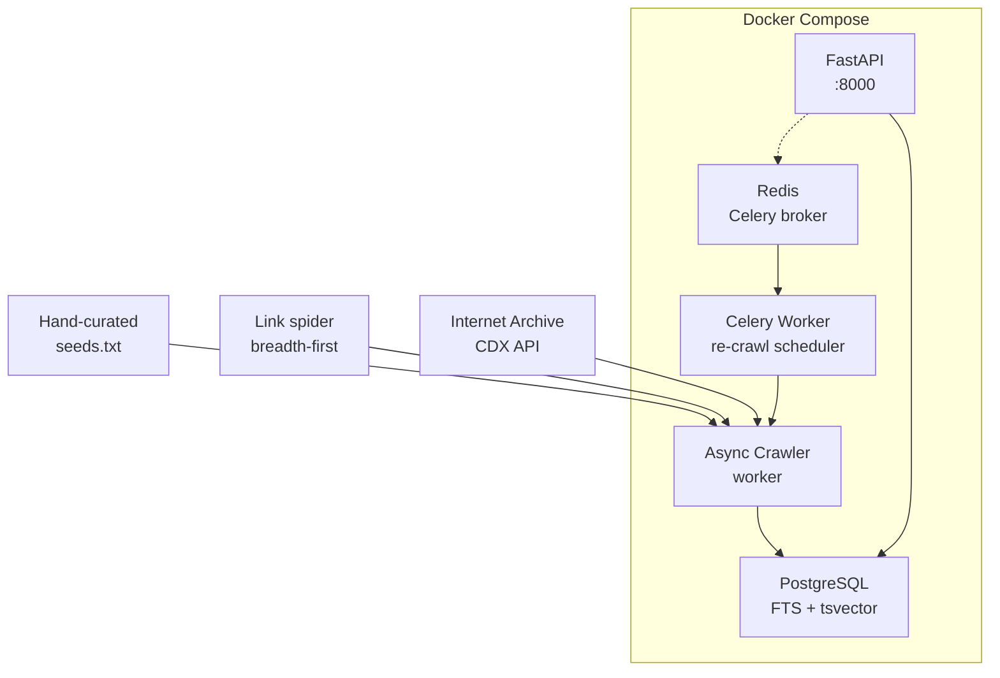

# The Collector — A Poor Man's Web Search Engine

A search engine that deliberately inverts the priorities of commercial search: **content matching only, no personalization, no regional weighting, no pay-to-rank**. The target corpus is non-SPA static sites that *feel* like the early internet — hand-coded HTML, old-web aesthetics, vintage personal pages that are invisible to modern SEO.

Think GeoCities, tilde.town, Neocities, indie webrings. The kind of sites that made the web interesting before algorithmic feeds and personalization.

---

## Current Status: Phase 1 (Personal Tool)

✅ **Complete:** Foundation (DB, schema, migrations) + Signal Engine (14 detectors, scoring, quarantine queue)
- **50 tests** across 3 test suites, all passing
- Local single-VPS architecture (Docker)
- Python 3.12, PostgreSQL, Redis, FastAPI, asyncio, Celery

🔄 **Planned (Phase 2–3):**
- Full crawler with security checks and rate limiting
- FastAPI admin/search API routes
- Celery re-crawl scheduler and CDX API client
- Minimal HTML UI (Phase 2)
- Multi-user seed submission (Phase 2)
- Public-facing deployment (Phase 3)

---

## Architecture Overview

Five Docker containers, one `docker-compose.yml`, one VPS:



**Stack:**
- **Language:** Python 3.12+
- **Async:** `httpx` + `asyncio` for concurrent crawling
- **HTML parsing:** BeautifulSoup4 + lxml (C-level parser, safe from ReDoS)
- **Encoding detection:** chardet on raw bytes before parsing
- **Database:** PostgreSQL 12+ with `tsvector` full-text search, `GIN` index, `ts_rank_cd` BM25-style ranking
- **API:** FastAPI (no ORM — raw asyncpg for explicit control)
- **Task scheduler:** Celery + Redis (periodic re-crawl, CDX imports, dead link checks)
- **Containerization:** Docker + Docker Compose (all services share one image, different commands)

---

## Quick Start

### 1. Prerequisites
- Docker & Docker Compose
- Python 3.12+ (for local development/testing)

### 2. Start the Stack

```bash
cd /Users/liz/Projects/the-collector
docker-compose up -d
```

Services start with:
- **db:** PostgreSQL, migrations run automatically, ready for queries
- **redis:** Celery broker
- **api:** FastAPI server (not yet implemented for Phase 1)
- **crawler:** Async worker (not yet wired up for Phase 1)
- **celery:** Beat scheduler + worker (not yet wired up for Phase 1)

### 3. Run Tests

```bash
# Inside the container:
docker-compose exec api pytest tests/ -v

# Or locally (requires local Python 3.12+ install + dependencies):
pip install -e ".[dev]"
pytest tests/ -v
```

All 50 tests pass. Test coverage:
- **test_foundation.py:** 5 tests (tables, indexes, FTS ranking, transaction isolation)
- **test_detectors.py:** 33 tests (all 14 signal detectors across fixture scenarios)
- **test_signals.py:** 12 tests (end-to-end scoring, quarantine routing, auto-reject checks)

### 4. Environment Configuration

Copy `.env.example` to `.env` (pre-configured for Docker):

```bash
cp .env.example .env
```

Key parameters:
- `SIGNAL_THRESHOLD=3` — minimum score to index a page (default tuning: personal sites often score 6+, commercial sites score 0–2)
- `CRAWL_WORKERS=5` — concurrent crawlers (respectful to target domains)
- `CRAWL_DELAY_SECONDS=2.0` — rate limiting between hits to same domain
- `CRAWL_DEPTH_MAX=3` — max hops from seed (e.g., seed → link → link → link = depth 3, stop)
- `RESPONSE_SIZE_LIMIT_BYTES=5242880` (5 MB) — gzip bomb protection

---

## Discovery Strategy: Three Sources

The problem: the best isolated old-web sites aren't linked from any modern directory.

### 1. **Internet Archive CDX API**
URLs captured 1996–2008 that still return HTTP 200 today. Free API, no crawling required.

### 2. **Link-following Spider**
Breadth-first crawl from known seed domains (Neocities, tilde.town, IndieWeb directories, Wiby). Discovers linked neighbors up to depth 3.

### 3. **Hand-curated Seeds** (`seeds.txt`)
When you stumble on something good, drop it in. Highest signal-to-noise.

**Starting seeds:**
```
https://neocities.org/browse
https://tilde.town
https://wiby.me/surprise/
https://curlie.org
https://indieweb.org/directory
https://ooh.directory
```

---

## Signal Engine: How Pages Are Scored

Every fetched page is scored before indexing. Must clear a threshold (default: **3**) to be indexed.

### Positive Signals (Old Web)

| Signal | Detection | Score |
|--------|-----------|-------|
| No JS framework | No `react`/`vue`/`angular`/`next`/`svelte`/`webpack` in source | +2 |
| Small page weight | Raw HTML under 100 KB | +2 |
| Old/retro HTML elements | `<font>`, `<table>` for layout, `<marquee>`, `<blink>`, `<frameset>`, etc. | +1 each, cap +3 |
| No commercial tracking | No GTM, Facebook Pixel, HotJar (Google Analytics is fine) | +2 |
| No cookie consent | No CookieBot, OneTrust, GDPR banner patterns | +2 |
| No JSON-LD | No `<script type="application/ld+json">` | +1 |
| Hand-coded smell | Inconsistent indentation, inline styles, no minification | +1 |
| Old content dates | `Last-Modified` header or `<meta name="date">` pre-2010 | +2 |
| Plain asset names | CSS/JS files named `style.css`, `main.js` (not hashed) | +1 |

### Negative Signals (Reduce Score)

| Signal | Detection | Score |
|--------|-----------|-------|
| Known SSG generator | `<meta name="generator">` with Hugo, Jekyll, Eleventy, etc. | -3 |
| Modern hosting platform | Domain is `*.github.io`, `*.netlify.app`, `*.vercel.app`, `*.pages.dev` | -2 |
| Hashed/minified assets | Filenames like `main.[hash].min.css` | -2 |

### Auto-Reject (Regardless of Score)

Pages are rejected **before scoring** if they match:

| Signal | Detection |
|--------|-----------|
| Single Page Application | `<div id="root">` or `<div id="app">` as primary body content |
| JS-rendered content | Body text < 200 chars but JS payload > 50 KB |
| Noindex directive | `<meta name="robots" content="noindex">` |

### Quarantine Queue

Pages that don't auto-reject but score close to the threshold (or have mixed signals) go to quarantine for human review instead of silent rejection:

- **Framesets** — HTML frame-based structure (content is in child frames)
- **Empty body** — Fetched successfully but extracted text < 50 chars
- **Mixed signals** — High old-web score (+6) but also strong negatives (-3)
- **Borderline** — Score within 2 points of threshold
- **Encoding uncertain** — chardet confidence < 0.7
- **Parse errors** — BeautifulSoup threw on malformed HTML

---

## Project Structure

```
the-collector/
├── collector/
│   ├── config.py                 # Pydantic Settings, all configurable params
│   ├── db.py                     # Shared asyncpg pool, thread-safe lazy init
│   ├── signals/
│   │   ├── detectors.py          # 14 pure signal detection functions
│   │   └── filter.py             # Scoring orchestrator + quarantine router
│   ├── crawler/                  # (Phase 2) Security, robots.txt, queue, rate limiting
│   ├── indexer/                  # (Phase 2) DB insert, FTS indexing
│   ├── tasks/                    # (Phase 2) Celery beat tasks
│   └── api/
│       ├── main.py               # (Phase 2) FastAPI app
│       └── routes/               # (Phase 2) /search, /seeds, /crawl, etc.
│
├── migrations/
│   ├── 001_initial_schema.sql    # 6 tables: pages, quarantine, crawl_queue, seeds, threat_log, blocked_domains
│   └── run_migrations.py         # Idempotent asyncpg runner
│
├── tests/
│   ├── conftest.py               # Event loop, test DB fixture, transaction isolation
│   ├── test_foundation.py        # 5 tests: schema, indexes, FTS, isolation
│   ├── test_detectors.py         # 33 tests: all 14 signal detectors
│   ├── test_signals.py           # 12 tests: scoring pipeline, quarantine routing
│   └── fixtures/                 # HTML samples for testing
│       ├── geocities_1999.html   # Classic 1990s page (font, marquee, table)
│       ├── react_app.html        # Modern SPA (div#root, hashed assets)
│       ├── jekyll_site.html      # Jekyll-generated (generator meta tag)
│       ├── frameset_page.html    # Frame-based (quarantine test)
│       └── borderline.html       # Modern personal page (below threshold)
│
├── docker-compose.yml            # Five services + health checks
├── Dockerfile                    # Python 3.12-slim + lxml build deps
├── pyproject.toml                # Dependencies, test config
├── .env.example                  # Configuration template
├── .gitignore                    # .env, __pycache__, .pytest_cache, etc.
├── seeds.txt                     # Hand-curated starting URLs
└── README.md                     # This file
```

---

## Database Schema

**pages** — Indexed content
- `id`, `url` (unique), `domain`, `title`, `raw_text`
- `search_vector` (generated `tsvector`, GIN index) — full-text search
- `old_web_score` (integer), `detected_signals` (JSONB) — explainability
- `status`, `crawled_at`, `last_seen_at`, `next_crawl_at`

**quarantine** — Pages that need human review
- `id`, `url` (unique), `raw_html`, `error_reason`, `partial_signals` (JSONB), `partial_score`
- `http_status`, `fetch_error`, `fetched_at`, `reviewed`

**crawl_queue** — BFS work queue (resumable across crashes)
- `id`, `url` (unique), `source_url`, `depth`, `status` (`pending`/`in_progress`/`done`/`failed`)
- `attempts`, `queued_at`, `next_attempt_at`, `claimed_at`, `claimed_by`, `last_error`

**seeds** — Hand-curated starting points
- `id`, `url` (unique), `label`, `source`, `added_at`

**threat_log** — Security events (SSRF, gzip bombs, spider traps, etc.)
- `id`, `url`, `domain`, `threat_type`, `detail`, `http_status`, `detected_at`, `domain_blocked`

**blocked_domains** — Domains flagged from threat_log
- `id`, `domain` (unique), `reason`, `source`, `blocked_at`

---

## Security

All checks run **before** HTML parsing, in order:

1. **Scheme check** — reject non-HTTP/S URLs immediately
2. **IP allowlist** — reject RFC1918 ranges + Docker service hostnames
3. **`Content-Length` cap** — reject before download if > 5 MB
4. **Decompressed size cap** — abort and log if decompressed bytes > 5 MB
5. **Timeout enforcement** — connect: 10s, read: 30s
6. **Per-page timeout** — 30s hard limit on signal detection + parsing
7. **URL normalization** — strip tracking params, detect spider traps
8. **Redirect validation** — re-run scheme + IP checks on every hop

Threat types logged to `threat_log`:
- `ssrf_attempt`, `gzip_bomb`, `spider_trap`, `redirect_violation`, `slow_response`, `recursion_bomb`, `oversized_response`

---

## Testing

All tests use fixtures (HTML samples) instead of mocking HTTP. This catches real parsing bugs early.

```bash
# Run all tests
pytest tests/ -v

# Run a specific suite
pytest tests/test_detectors.py -v

# Run with coverage
pytest tests/ --cov=collector
```

**Test philosophy:**
- Signal detectors are **pure functions** (no I/O, no DB) — trivial to unit test
- Scoring pipeline uses **fixtures** instead of HTTP mocking — catches parsing edge cases
- Database tests use **transaction rollback** for isolation (all tests share one test DB)
- No external network calls — CDX API and crawling are Phase 2

---

## Development Phases

### Phase 1: Personal Tool ✅
- Single VPS, local/developer only
- Foundation: schema, migrations, DB pool
- Signal Engine: 14 detectors, scoring, quarantine queue
- **Status:** Complete, 50 tests passing

### Phase 2: Self-Hosted & Shareable 🔄
- Minimal HTML UI
- Full crawler with security checks, robots.txt, rate limiting
- FastAPI admin routes: `/search`, `/seeds`, `/crawl`, `/quarantine`, `/stats`
- Celery re-crawl scheduler (periodic, configurable)
- CDX API client (queries Internet Archive for old URLs)
- Multi-user seed submission
- Dead link checker (periodic HEAD requests)

### Phase 3: Public-Facing
- Authentication & API keys
- Rate limiting per user
- Distributed/multi-machine crawling
- Common Crawl integration (Phase 2 uses CDX API only)
- Semantic/embedding search (optional)

---

## How to Contribute Signals

Each signal is a pure Python function in `collector/signals/detectors.py`:

```python
def detect_example(soup: BeautifulSoup) -> int:
    """Returns +N if signal detected, 0 otherwise."""
    # No side effects, no DB, no network
    return N if condition else 0
```

Add a test case to `tests/test_detectors.py`:

```python
def test_detect_example():
    soup = BeautifulSoup(html_fixture, 'lxml')
    score = detect_example(soup)
    assert score == expected_score
```

Run `pytest` — new tests are auto-discovered.

---

## Tuning the Threshold

The default `SIGNAL_THRESHOLD=3` is tuned for Phase 1 personal exploration. Adjust in `.env`:

- **Higher threshold (5–6):** More selective (fewer false positives), fewer pages indexed
- **Lower threshold (1–2):** More permissive (more false positives), noisier results

Monitor quarantine entries to see what nearly makes it in. Use `POST /quarantine/{id}/rescore` (Phase 2) to re-run detectors after tuning weights.

---

## Design Decisions

| Decision | Rationale |
|----------|-----------|
| **PostgreSQL, not SQLite** | Single VPS is fine, but need concurrent read/write (SQLite locks). FTS with `tsvector` is fast and integrated. |
| **Signal detectors as pure functions** | Easy to test in isolation, easy to add/remove, explicit scoring. |
| **Quarantine queue for ambiguous pages** | Human review preserves quality over silent rejection. |
| **Async crawler** | Respectful to target domains (rate limiting), resumable (crawl_queue status survives crashes). |
| **Five Docker containers** | Simple to reason about, easy to scale (Phase 2), shared image = faster builds. |
| **lxml parser** | C-level implementation, resistant to deeply nested HTML and malformed markup. |
| **No ORM** | Raw asyncpg for explicit control; ORMs hide query complexity and concurrency issues. |

---

## Known Limitations (Phase 1)

- **No crawler yet** — Phase 2
- **No API yet** — Phase 2
- **No re-crawl scheduler** — Phase 2
- **No CDX API client** — Phase 2
- **Single VPS only** — Phase 3
- **No public UI** — Phase 2+

---

## Next Steps

1. **Phase 2 Crawler:** Security checks, robots.txt cache, rate limiter, link extractor, queue manager
2. **Phase 2 Indexer:** `INSERT pages` with FTS trigger, `UPDATE pages` for re-crawl
3. **Phase 2 API:** FastAPI routes for `/search`, `/seeds`, `/crawl`, `/quarantine`
4. **Phase 2 Celery:** Beat tasks for re-crawl (30-day cycle), CDX import, dead link check
5. **Phase 2 UI:** Minimal HTML form for seed submission, search results

---

## Questions?

- **Why no Wayback Machine integration?** Preservation is out of scope for Phase 1. CDX API queries archived URLs but doesn't save new ones.
- **Why not use Elasticsearch?** Overkill for Phase 1. PostgreSQL FTS is fast enough and eliminates external dependencies.
- **Why hand-curated seeds?** High signal-to-noise. You know what's good; automated discovery adds noise.
- **Why 3-hop depth limit?** Balances discovery (neighbors of neighbors) against spider traps and noise.

---

## License

No license specified yet (exploratory project).
