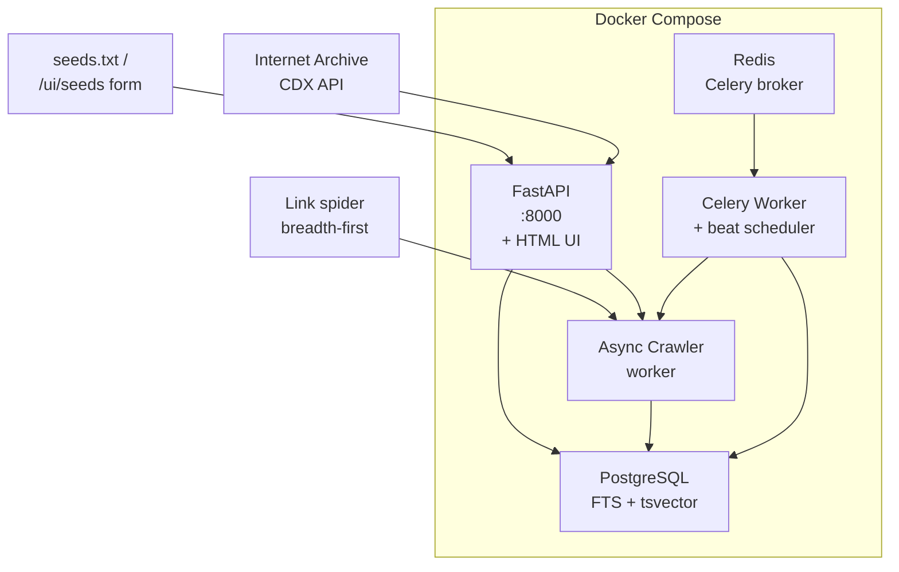
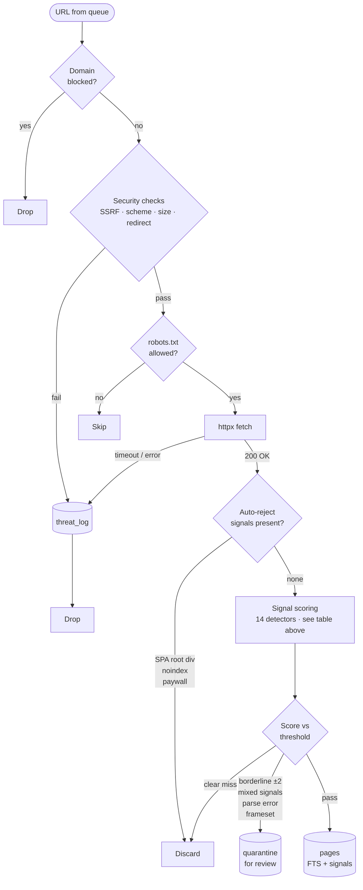
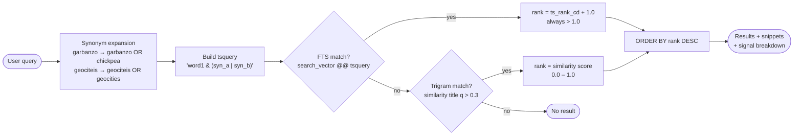

# The Collector — A Poor Man's Web Search Engine

A search engine that deliberately inverts the priorities of commercial search: **content matching only, no personalization, no regional weighting, no pay-to-rank**. The target corpus is non-SPA static sites that *feel* like the early internet — hand-coded HTML, old-web aesthetics, vintage personal pages that are invisible to modern SEO.

Think GeoCities, tilde.town, Neocities, indie webrings. The kind of sites that made the web interesting before algorithmic feeds and personalization.

---

## Current Status

✅ **Phase 1 complete** — Foundation, Signal Engine, Crawler, API, Celery tasks
✅ **Phase 2 complete** — Full HTML UI: search, seeds, stats, quarantine, threats/blocked-domains, CDX import
🔄 **Fuzzy search** — pg_trgm trigram matching + query-side synonym expansion (shipped)
⏳ **Phase 3** — auth, rate limiting, public deployment

**101 tests passing** across 9 suites. Stack runs end-to-end via `docker compose up`.

---

## What You Can Do Right Now

After `docker compose up -d`, point a browser at **http://localhost:8000** and:

| URL | What it does |
|---|---|
| `/` | Search the index — typed query → ranked results with snippets + signal breakdown |
| `/ui/seeds` | Add seed URLs via form, view current seed list |
| `/ui/stats` | Index size, crawl queue depth, **Start Crawl** button, **CDX import** form |
| `/ui/quarantine` | Review borderline pages — approve, reject, or rescore each |
| `/ui/threats` | Security event log — SSRF attempts, gzip bombs, spider traps; one-click domain block |
| `/docs` | Swagger UI for the JSON API |
| `/redoc` | ReDoc reference docs |

The UI is **server-rendered Jinja templates, no JavaScript, no framework**. Georgia + system colors. It deliberately looks like the kind of site it's trying to surface — eats its own dog food.

---

## Architecture Overview

Five Docker containers, one `docker-compose.yml`, one VPS:



**Stack:**
- **Language:** Python 3.12+
- **Async:** `httpx` + `asyncio` for concurrent crawling
- **HTML parsing:** BeautifulSoup4 + lxml (C-level parser, resistant to ReDoS)
- **Encoding detection:** chardet on raw bytes before parsing
- **Database:** PostgreSQL 16 with `tsvector` FTS, `GIN` index, `ts_rank_cd` BM25-style ranking, `pg_trgm` for fuzzy/typo matching
- **API:** FastAPI (no ORM — raw asyncpg for explicit query control)
- **Templates:** Jinja2, server-rendered, no JS
- **Task scheduler:** Celery + Redis (periodic re-crawl, CDX imports, dead link checks)
- **Containerization:** Docker + Docker Compose (all Python services share one image, different commands)

---

## Quick Start

### 1. Prerequisites
- Docker & Docker Compose
- (Optional) Python 3.12+ for local development

### 2. Start the stack

```bash
git clone https://github.com/Edinunzio/the-collector.git
cd the-collector
cp .env.example .env
docker compose up -d
```

The first `up` builds the image (~2 min). After that:

- **db** (PostgreSQL 16) — runs migrations idempotently on first start
- **redis** — Celery broker + result backend
- **api** — uvicorn at http://localhost:8000 (also serves HTML UI)
- **crawler** — runs once when started (drains queue, then exits — re-trigger from `/ui/stats`)
- **celery** — beat scheduler + worker (re-crawl every 6h, dead links Sun 3am UTC)

### 3. Add seeds + crawl

Either via the UI (http://localhost:8000/ui/seeds) or:
```bash
curl -X POST http://localhost:8000/seeds/bulk \
  -H "Content-Type: application/json" \
  -d '{"file_path": "/app/seeds.txt"}'
curl -X POST http://localhost:8000/crawl/start
```

Watch progress: http://localhost:8000/ui/stats

### 4. Search

```
http://localhost:8000/?q=tropical+fish
```

Or via the API: `GET /search?q=...&page=0&limit=10` → JSON with results, snippets, signal breakdown.

### 5. Run tests

```bash
docker compose exec api pytest tests/ -v
```

Should report `101 passed`.

---

## Configuration

Edit `.env` (template in `.env.example`):

| Variable | Default | What it does |
|---|---|---|
| `SIGNAL_THRESHOLD` | `3` | Minimum score to index. Higher = more selective. |
| `CRAWL_WORKERS` | `5` | Concurrent crawl coroutines |
| `CRAWL_DELAY_SECONDS` | `2.0` | Per-domain rate limit |
| `CRAWL_DEPTH_MAX` | `3` | Max hops from seed |
| `CRAWL_DOMAIN_PAGE_CAP` | `500` | Per-domain page cap (prevents one site dominating) |
| `RESPONSE_SIZE_LIMIT_BYTES` | `5242880` (5 MB) | Pre-download size cap + gzip-bomb guard |
| `CHARDET_CONFIDENCE_THRESHOLD` | `0.7` | Below this → page goes to quarantine for review |
| `HTTPX_CONNECT_TIMEOUT` | `10.0` | Per-request connect timeout (seconds) |
| `HTTPX_READ_TIMEOUT` | `30.0` | Per-request read timeout |
| `PAGE_PROCESS_TIMEOUT` | `30.0` | Hard limit on signal detection + parsing (ReDoS guard) |

---

## Discovery Strategy: Three Sources

The problem: the best isolated old-web sites aren't linked from any modern directory.

### 1. **Internet Archive CDX API**
URLs captured 1996–2008 that still return HTTP 200 today. Free API, no crawling required.
Trigger from `/ui/stats` → CDX import form, or `POST /tasks/import-cdx`.

### 2. **Link-following Spider**
Breadth-first crawl from known seed domains. Discovers linked neighbors up to depth 3.

### 3. **Hand-curated Seeds** (`seeds.txt` + `/ui/seeds`)
When you stumble on something good, drop it in. Highest signal-to-noise.

**Starting seeds shipped in `seeds.txt`:**
```
https://neocities.org/browse
https://tilde.town
https://wiby.me/surprise/
https://curlie.org
https://indieweb.org/directory
https://ooh.directory
```

---

## Signal Engine: How Pages Are Scored

Every fetched page is scored before indexing. Must clear `SIGNAL_THRESHOLD` (default: **3**) to be indexed.

### Positive Signals (Old Web)

| Signal | Detection | Score |
|--------|-----------|-------|
| No JS framework | No `react`/`vue`/`angular`/`next`/`svelte`/`webpack` in source | +2 |
| Small page weight | Raw HTML under 100 KB | +2 |
| Old/retro HTML elements | `<font>`, `<table>` for layout, `<marquee>`, `<blink>`, `<frameset>`, etc. | +1 each, cap +3 |
| No commercial tracking | No GTM, Facebook Pixel, HotJar (Google Analytics is fine) | +2 |
| No cookie consent | No CookieBot, OneTrust, GDPR banner patterns | +2 |
| No JSON-LD | No `<script type="application/ld+json">` | +1 |
| Hand-coded smell | Inconsistent indentation, inline styles, no minification | +1 |
| Old content dates | `Last-Modified` header or `<meta name="date">` pre-2010 | +2 |
| Plain asset names | CSS/JS files named `style.css`, `main.js` (not hashed) | +1 |

### Negative Signals (Reduce Score)

| Signal | Detection | Score |
|--------|-----------|-------|
| Known SSG generator | `<meta name="generator">` with Hugo, Jekyll, Eleventy, etc. | -3 |
| Modern hosting platform | Domain is `*.github.io`, `*.netlify.app`, `*.vercel.app`, `*.pages.dev` | -2 |
| Hashed/minified assets | Filenames like `main.[hash].min.css` | -2 |

### Auto-Reject (Regardless of Score)

| Signal | Detection |
|--------|-----------|
| Single Page Application | `<div id="root">` or `<div id="app">` as primary body content |
| JS-rendered content | Body text < 200 chars but JS payload > 50 KB |
| Noindex directive | `<meta name="robots" content="noindex">` |

### Quarantine Queue

Pages that don't auto-reject but score close to the threshold (or have mixed signals) go to quarantine for human review instead of silent rejection:

- **Framesets** — content lives in child frames (those get re-enqueued)
- **Empty body** — fetched successfully but extracted text < 50 chars (often redirects)
- **Mixed signals** — high old-web score (+6) but also strong negatives (-3)
- **Borderline** — score within 2 points of threshold
- **Encoding uncertain** — chardet confidence < 0.7
- **Parse errors** — BeautifulSoup threw on malformed HTML

Review via http://localhost:8000/ui/quarantine — one-click **Approve** / **Reject** / **Rescore** per item.

---

## The Algorithm

Two pipelines: one decides what gets **indexed**, one decides how **search results are ranked**.

### Indexing Pipeline — What Gets In

Every URL from the crawl queue runs this gauntlet before it can appear in search results:



Every score component is stored as JSONB (`detected_signals`) so you can always explain why a page ranked the way it did or was held for review.

---

### Search Pipeline — How Results Are Ranked

A query goes through synonym expansion before hitting the database, and results are scored by two complementary methods:



**Why FTS always beats trigram:** The `+1.0` offset means every FTS result scores above `1.0`, and trigram similarity is bounded `0–1`. No score normalisation needed — the math guarantees the right order.

**Why two layers?** They catch different failure modes:

| Layer | Catches | Misses |
|---|---|---|
| FTS (`tsvector` + `ts_rank_cd`) | Exact and stemmed matches (`fish` → `fishing`) | Typos, misspellings |
| Synonym expansion | Word-level equivalence (`garbanzo` = `chickpea`) | Typos in the synonyms themselves |
| Trigram (`pg_trgm`) | Character-level typos (`geociteis` → `geocities`) | Completely different words |

Add synonyms in `collector/search/synonyms.py`. Add signals in `collector/signals/detectors.py`.

---

## Project Structure

```
the-collector/
├── collector/
│   ├── config.py                 # Pydantic Settings, all configurable params
│   ├── db.py                     # Shared asyncpg pool, thread-safe lazy init
│   ├── signals/
│   │   ├── detectors.py          # 14 pure signal detection functions
│   │   └── filter.py             # Scoring orchestrator + quarantine router
│   ├── crawler/
│   │   ├── security.py           # SSRF / scheme / size pre-request checks
│   │   ├── robots.py             # Per-domain robots.txt cache
│   │   ├── queue.py              # Postgres-backed crawl queue
│   │   ├── cdx.py                # Internet Archive CDX API client
│   │   └── worker.py             # Async fetch → filter → index pipeline
│   ├── search/
│   │   └── synonyms.py           # Hand-curated synonym dict + expand() helper
│   ├── indexer/
│   │   └── db.py                 # Upsert pages, quarantine, threat log
│   ├── tasks/
│   │   └── celery_app.py         # Beat schedule + recrawl/dead-link/CDX tasks
│   └── api/
│       ├── main.py               # FastAPI app with lifespan DB pool
│       ├── routes/
│       │   ├── search.py         # GET /search (FTS + pg_trgm + synonym expansion)
│       │   ├── seeds.py          # /seeds CRUD + bulk
│       │   ├── crawl.py          # /crawl/start, /crawl/status
│       │   ├── pages.py          # /pages/{id}, /stats
│       │   ├── quarantine.py     # /quarantine list/approve/reject/rescore
│       │   ├── threats.py        # /threats, /blocked-domains
│       │   ├── tasks.py          # /tasks/import-cdx
│       │   └── ui.py             # HTML UI routes (not in OpenAPI schema)
│       └── templates/
│           ├── base.html         # Shared chrome, nav, CSS
│           ├── search.html       # Home + results
│           ├── stats.html        # Index + crawl + CDX import form
│           ├── seeds.html        # Add + list seeds
│           ├── quarantine.html   # Review queue
│           └── threats.html      # Security log + blocked-domains panel
│
├── migrations/
│   ├── 001_initial_schema.sql    # 6 tables + GIN index + generated tsvector
│   ├── 002_pg_trgm.sql           # pg_trgm extension + GIN trigram index on title
│   └── run_migrations.py         # Idempotent asyncpg runner
│
├── tests/                        # 101 tests across 9 suites
│   ├── conftest.py               # Test DB fixture, transaction rollback isolation
│   ├── test_foundation.py        # 5 — schema, indexes, FTS, isolation
│   ├── test_detectors.py         # 33 — all 14 signal detectors
│   ├── test_signals.py           # 12 — scoring pipeline, quarantine routing
│   ├── test_security.py          # 21 — SSRF, schemes, normalization, entropy
│   ├── test_cdx.py               # 3 — CDX API client with respx mocks
│   ├── test_crawler.py           # 3 — full crawler integration (pytest-httpserver)
│   ├── test_api.py               # 8 — all routes via FastAPI AsyncClient
│   ├── test_tasks.py             # 3 — Celery task import smoke tests
│   ├── test_search_fuzzy.py      # 13 — synonym expansion + trigram matching
│   └── fixtures/                 # HTML samples
│
├── docker-compose.yml            # 5 services + health checks
├── Dockerfile                    # Python 3.12-slim + lxml build deps
├── pyproject.toml                # Dependencies, test config
├── .env.example                  # Configuration template
├── seeds.txt                     # Hand-curated starting URLs
└── README.md                     # This file
```

---

## Database Schema

**pages** — Indexed content
- `id`, `url` (unique), `domain`, `title`, `raw_text`
- `search_vector` (generated `tsvector`, GIN-indexed) — full-text search
- `old_web_score` (integer), `detected_signals` (JSONB) — explainability
- `status` (`active` / `dead`), `crawled_at`, `last_seen_at`, `next_crawl_at`

**quarantine** — Pages held for human review
- `id`, `url` (unique), `raw_html`, `error_reason`, `partial_signals` (JSONB), `partial_score`
- `http_status`, `fetch_error`, `fetched_at`, `reviewed`

**crawl_queue** — BFS work queue (resumable across crashes)
- `id`, `url` (unique), `source_url`, `depth`, `status` (`pending` / `in_progress` / `done` / `failed`)
- `attempts`, `queued_at`, `next_attempt_at`, `claimed_at`, `claimed_by`, `last_error`

**seeds** — Hand-curated starting points
- `id`, `url` (unique), `label`, `source` (`manual` / `file`), `added_at`

**threat_log** — Security events (SSRF, gzip bombs, spider traps, etc.)
- `id`, `url`, `domain`, `threat_type`, `detail`, `http_status`, `detected_at`, `domain_blocked`

**blocked_domains** — Domains flagged from threat_log
- `id`, `domain` (unique), `reason`, `source`, `blocked_at`

**schema_migrations** — Tracks applied migration files (idempotency)

---

## Security

All checks run **before** HTML parsing, in this order:

1. **Scheme check** — reject non-HTTP/S URLs (no `file://`, `gopher://`, `ftp://`, etc.)
2. **Hostname / IP check** — reject Docker service hostnames (`db`, `redis`, `api`) and RFC1918 / loopback / link-local ranges
3. **`Content-Length` cap** — reject before download if header exceeds 5 MB
4. **Downloaded size cap** — abort and log if response body exceeds 5 MB
5. **Connect / read timeouts** — `httpx` 10s connect, 30s read
6. **Per-page processing timeout** — 30s hard limit on signal detection + parsing (ReDoS guard)
7. **URL normalization** — strip session/UTM/tracking params before enqueue
8. **High-entropy query detection** — drop spider-trap-shaped URLs at enqueue time
9. **Redirect re-validation** — re-run scheme + IP checks on the final URL after redirects

Every violation logs to `threat_log`:
- `ssrf_attempt`, `gzip_bomb`, `spider_trap`, `redirect_violation`, `slow_response`, `recursion_bomb`, `oversized_response`

Domains in `blocked_domains` are checked at queue-pop time — blocked URLs are dropped before any network request.

---

## Testing

```bash
# Full suite (88 tests, ~1.5s)
docker compose exec api pytest tests/ -v

# Specific suite
docker compose exec api pytest tests/test_security.py -v
```

**Test philosophy:**
- Signal detectors are **pure functions** (no I/O, no DB) — trivial to unit test
- Crawler tests use **pytest-httpserver** (real HTTP, fake server) — catches parsing bugs HTTP mocks miss
- CDX client tests use **respx** to mock the Internet Archive API
- Database tests use **transaction rollback** for per-test isolation
- No external network calls in any test

---

## Development Phases

### Phase 1: Personal Tool ✅ **Complete**
- Foundation: schema, migrations, asyncpg pool
- Signal Engine: 14 detectors, scoring, quarantine routing
- Crawler: security, robots, queue, fetch pipeline, link spider, frame handling
- API: search, seeds, crawl control, pages, quarantine, threats, CDX trigger
- Celery: re-crawl scheduler, dead-link checker, CDX batch import

### Phase 2: Self-Hosted & Shareable ✅ **Complete**
- ✅ HTML UI: search, seeds, stats, quarantine review, threats + blocked-domains
- ✅ CDX import trigger from UI
- ✅ Fuzzy search: pg_trgm trigram matching + query-side synonym expansion
- **101 tests passing** across 9 suites

### Phase 3: Public-Facing ⏳
- Authentication & API keys (single admin password + API key for JSON endpoints)
- Per-IP rate limiting on search
- Distributed / multi-machine crawling
- Common Crawl integration (Phase 2 uses CDX only)

---

## How to Add a Signal

Each signal is a pure Python function in `collector/signals/detectors.py`:

```python
def detect_example(soup: BeautifulSoup) -> int:
    """Returns +N if signal detected, 0 otherwise."""
    # No side effects, no DB, no network
    return N if condition else 0
```

Wire it into `collector/signals/filter.py` (add to the signals dict in `score_page`).

Add a test case to `tests/test_detectors.py`:

```python
def test_detect_example():
    soup = BeautifulSoup(html_fixture, 'lxml')
    score = detect_example(soup)
    assert score == expected_score
```

Run `pytest tests/test_detectors.py -v`. After tuning, re-score quarantine entries with `POST /quarantine/{id}/rescore`.

---

## Tuning the Threshold

Default `SIGNAL_THRESHOLD=3` is calibrated for personal exploration. Adjust in `.env`:

- **Higher (5–6):** More selective. Fewer indexed, fewer false positives.
- **Lower (1–2):** More permissive. Noisier results.

Monitor `/ui/quarantine` to see what nearly makes it in — adjust thresholds and rescore individual items, or restart the stack to apply globally.

---

## Design Decisions

| Decision | Rationale |
|---|---|
| **PostgreSQL, not SQLite** | Concurrent read/write under crawler load; FTS via `tsvector` is fast and integrated. |
| **Signal detectors as pure functions** | Easy to test, easy to add, every score component is explainable. |
| **Quarantine queue for ambiguous pages** | Human review preserves quality over silent rejection. |
| **Async crawler** | Respectful (per-domain rate limit), resumable (queue state survives crashes). |
| **lxml parser** | C-level implementation, resistant to malformed and deeply nested HTML. |
| **No ORM** | Raw asyncpg for explicit query control; ORMs hide query and concurrency behavior. |
| **Server-rendered Jinja UI, no JS** | The UI should look like the kind of site it indexes. Also: 1 KB load, no build step. |
| **POST → 303 → GET for all forms** | Refresh-safe; no double-submit; no client state. |
| **UI routes call JSON handlers as Python functions** | Single source of truth for business logic. UI just renders. |

---

## Known Limitations

- **No auth** — Phase 1/2 is local-only. Don't expose port 8000 publicly without Phase 3 auth.
- **Crawler container exits after queue drain** — re-trigger from `/ui/stats` or `POST /crawl/start`. Alternative: run `docker compose up crawler` again.
- **No semantic search** — keyword + fuzzy (pg_trgm) + synonyms, but no embeddings. Semantic search is Phase 3 or later.
- **CDX queries are synchronous within the background task** — large imports can take minutes.

---

## FAQ

- **Why no Wayback Machine preservation?** Out of scope. CDX queries archived URLs to discover live ones; preserving new captures is a separate problem.
- **Why not Elasticsearch?** Overkill for this scale. PostgreSQL FTS + `pg_trgm` (typo tolerance) + query-side synonyms covers the meaningful gaps without an extra service to operate.
- **Why hand-curated seeds?** Highest signal-to-noise. You know what's good; automated discovery adds noise that the signal filter has to fight against.
- **Why 3-hop depth?** Balances neighbor-of-neighbor discovery against spider traps and noise.
- **Why Georgia for the UI font?** It's calm and readable, ships on every OS, and isn't trying to be a brand. Old-web aesthetic.

---

## License

No license specified yet (exploratory project).
